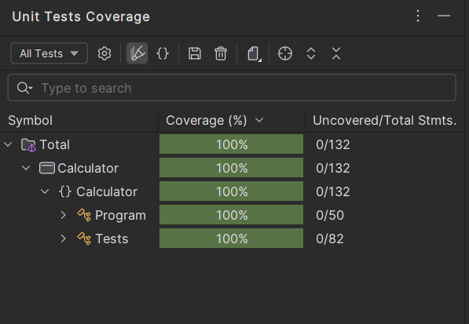

# KSU SWE 3643 Software Testing and Quality Assurance Semester Project:-Web-Based-Calculator

Our repository currently contains Calculator3 which holds our Calculator Logic. The WebsiteCal which is using ASP.NET Blazor Server. We are using Nunit + Playwright to do our testing.

## Table of Contents

-  [Introduction](#-KSU-SWE-3643-Software-Testing-and-Quality-Assurance-Semester-Project:-Web-Based-Calculator))
-  [Table of Contents](#Table-of-Contents)
-  [Team Members](#Team-Members)
-  [Architecture](#Architecture)
-  [Environment](#Environment)
-  [Executing the Web Application](#Executing-the-Web-Application)
-  [Executing Unit Tests](#Executing-Unit-Tests)
-  [Reviewing Unit Test Coverage](#Reviewing-Unit-Test-Coverage)
-  [Executing End-To-End Tests](#Executing-End-To-End-Tests)
-  [OPTIONAL EXTRA CREDIT: Static Analysis](#application-structure-requirements)
-  [Final Video Presentation](#Final-Video-Presentation)

# Team Members
Conner Abel  
Basile Sounantharak 

# Architecture
[![[image-20240128222116749]](UMLDiagram.png)](https://www.plantuml.com/plantuml/uml/VL9TQzj047pNhrYIbuJK_G5jAP4Jb_YXngHo2gKWphf5ERg-LU_3gYdvxz565ZwZsFVWysfcxtPcxjO7vKBSKAQ8kDsOVyRMMTQewe-g4Ixk55MHL61t0PTawkUmfeZP_mowLP7o7WwKcQsDHUX1MJUGQtqrjqqC-GTuswVNdnDuzZSgycD6GYcKpVU4ezP7h4pZk59qZBvasSkx0c0_tigQ00Nwu65h52oa_ZYesw7O8FfEg1DstooSlKGJ3DkoQFcUuvhGbykkzUfwJxWtM-E5CA3oGUDqzmiT2qjcXZCtJIPVH-X9bJzn3J_GRT51tZJZr7fPtraZ-KFzPB1DoZksmJ4HEY-ZfRLCCz37G7_k61aBE9sIdXGywROaf2MfNUj4o75Gy7vGkc3vIMA2cuJGMRGoPPTRbrZvzdXy7zYOkfftMTPOc41Oplq16CZZS_jqln6hO6ozP6F3awA8kTKIUFc88Jhh5npoHToiqSsSOtTu1t1IYjYOsle97efYANGIbtvRU42b2Rs7gUFMenEJA-AeuJ8nxDbeXCguYh2tBsc0uHzyENDTT-ujMXqtz0e0)

# Environment
This is a non-platform application and should work only in Windows 10.  

To prepare your environment to execute this application:
 1. [Install the latest Visual Studio for your system.](https://visualstudio.microsoft.com/downloads/)
 2. [Install ASP.NET Blazor Server](https://dotnet.microsoft.com/en-us/learn/aspnet/blazor-tutorial/install)  
 3. [Install .NET Core 3.1 ](https://dotnet.microsoft.com/en-us/download/dotnet/3.1)  
 4. [Install Visual Studio 17.8 ](https://devblogs.microsoft.com/visualstudio/visual-studio-17-8-now-available/)

## Executing the Web Application

1. Open CMD (Command Prompt)

2. Type path to the project (Ex: 
cd C:\Users\yourname\Downloads\SWE3643Project-main\SWE3643Project-main\WebsiteCal\WebsiteCal)  

3. Build project with dotnet run.

4. After the application starts, launch a browser and connect to localhost provided (Ex localhost:5001)

Sample Output

>Starting IIS Express ...
Successfully registered URL "http://localhost:24477/" for site "WebsiteCal" application "/"
Successfully registered URL "https://localhost:44335/" for site "WebsiteCal" application "/"
Registration completed for site "WebsiteCal"
IIS Express is running.
info: Microsoft.Hosting.Lifetime[0]
      Application started. Press Ctrl+C to shut down.
info: Microsoft.Hosting.Lifetime[0]
      Hosting environment: Development
info: Microsoft.Hosting.Lifetime[0]
      Content root path: C:\Users\basil\source\repos\WebsiteCal\WebsiteCal

## Executing Unit Tests

1. Open CMD (Command Prompt)

2. Type path to the project (Ex: 
cd C:\Users\yourname>cd C:\Users\yourname\source\repos\Calculator)  

3. Run project with dotnet test.

Sample Output
>Starting test execution, please wait...
A total of 1 test files matched the specified pattern.  

>Passed!  - Failed:     0, Passed:    19, Skipped:     0, Total:    19, Duration: 10 ms - Calculator.dll (net6.0)

## Reviewing Unit Test Coverage

## Executing End-To-End Tests

1. Open CMD (Command Prompt)

2. Type path to the project (Ex: 
cd C:\Users\yourname\source\repos\PlaywrightTests.csproj\PlaywrightTests.csproj)  

3. Building Web Application (Ex: msbuild PlaywrightTests.csproj)  

4. Next find executable file (Ex: G:\software\New New\SWE3643Project\src\PlaywrightTests\bin\Debug\net8.0\testhost.exe)  
  
5. Running Playwright Tests (Ensure Playwright dependency is Installed) (Enter in CMD: npm install playwright)  
  
6. Lastly Execute test node (Ex: node UnitTest1.cs)

Sample Output
>========== Starting test run ==========
NUnit Adapter 4.5.0.0: Test execution started
Running selected tests in C:\Users\basil\PlaywrightTests\bin\Debug\net8.0\PlaywrightTests.dll
   NUnit3TestExecutor discovered 5 of 5 NUnit test cases using Current Discovery mode, Non-Explicit run
NUnit Adapter 4.5.0.0: Test execution complete
========== Test run finished: 5 Tests (5 Passed, 0 Failed, 0 Skipped) run in 6.7 sec ==========

## Final Video Presentation
(Video Link Here)
Either link to youtube or vimeo  
or place into our repository

